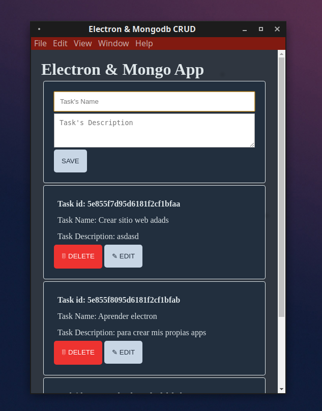

## Electron Mongodb CRUD

1 desktop app dùng để ghi chú có chức năng thêm xóa, sử dụng database. Đây là app sử dụng electron-forge - 1 tính năng mới của ElectronJS, giúp việc đóng gói, publish 1 app trở nên nhanh chóng và dễ dàng hơn.

## Đóng gói và Publish

```bash
npm run make
npm run publish
```



### Yêu cầu môi trường

- Nodejs

### Mẹo

- Sử dụng cú pháp

```
npx electronmon . 
```
để thay thế cho việc cài đặt nodemon

### Environment variables

```
MONGODB_URI
```

## Installation

```bash
npm i
npm start
```

Happy coding! :)